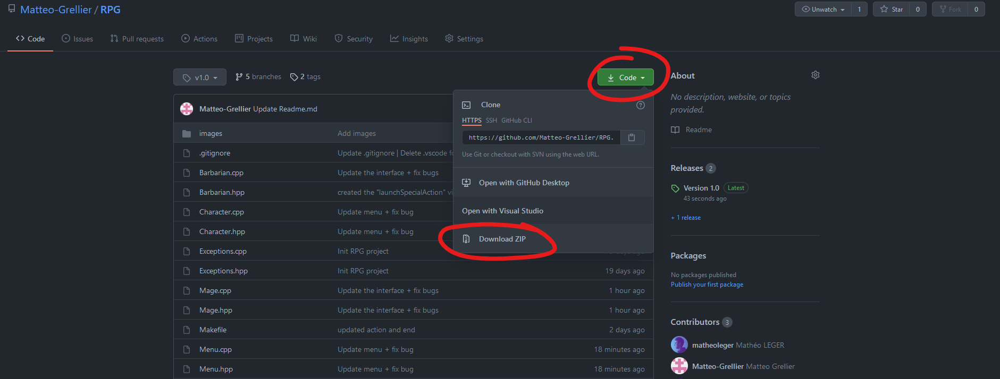

# RPG

## Descripion du projet

Ce projet à pour but de réaliser un jeu type RPG en c++ jouable directement dans le terminale 

## Comment utiliser le projet 

1.Tout d'abord il faut télécharger le projet 

2.Aller à l'emplacement du dossier dans le terminale de votre éditeur de texte

3.Éxecuter la commande `make`

4.Éxecuter la commande `./rpg`

## Auteurs

Projet Réalisé par :

* Mathéo Léger : 
  - Classe monstre
  - Méthodes virtuelles
  - Système de combat
* Louis Brochard :
  - Interface en ligne de commande
  - Message fin de combat
* Matteo Grellier : 
  - Classe Prêtre
  - README.md
  - Github / git